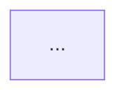
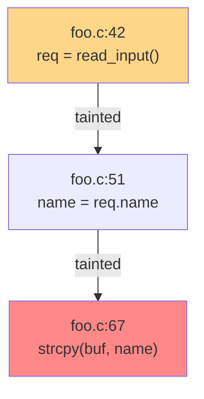
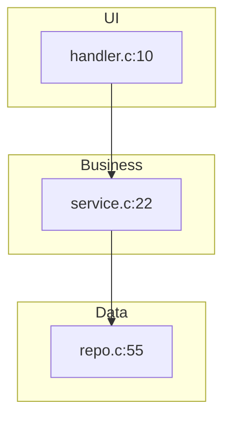
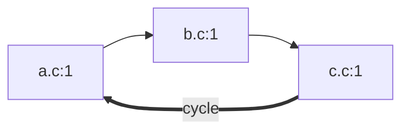
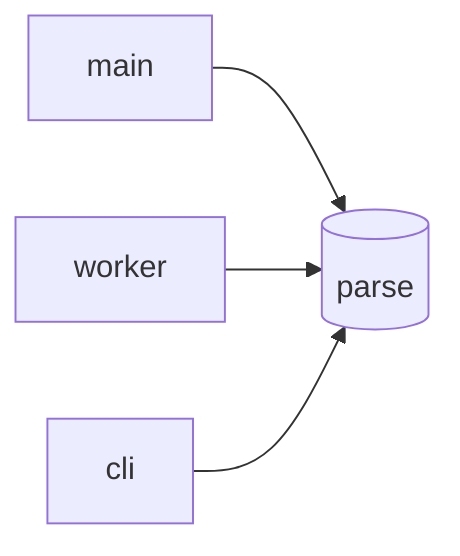

# Data-flow visualization — design

**Status:** Draft 2026-05-09. Implementation plan to follow.

**Goal:** Emit Mermaid flowcharts alongside prism's findings so downstream PR-review tooling (Greptile-style) can render data-flow / call-graph visuals inline in PR comments. Each flow-native algorithm produces its own shape; consumers paste the rendered Mermaid block directly, or re-render from the structured graph data.

**Inspiration:** The Greptile PR comment style — a Mermaid flowchart embedded in markdown, GitHub-rendered natively, showing the relevant data-flow path through the change.

---

## 1. Scope

**In scope.** 14 of prism's 30 algorithms have natural graph semantics and will populate diagrams:

| Algorithm | Shape | Granularity |
|---|---|---|
| Taint | Chain | per-finding |
| Chop | Chain | per-finding |
| Provenance | Chain | per-finding |
| LeftFlow | Chain | per-result |
| FullFlow | Chain | per-result |
| Delta | Chain | per-finding |
| Gradient | Chain | per-result |
| Vertical | Layered | per-result |
| Membrane | Layered | per-result |
| Echo | Fanout | per-result |
| Barrier | Fanout | per-result |
| Spiral | Fanout | per-result |
| ThreeD | Fanout | per-result |
| Circular | Cycle | per-result, one diagram per cycle found |

**Out of scope.** The remaining 16 algorithms (OriginalDiff, ParentFunction, ThinSlice, RelevantSlice, ConditionedSlice, Quantum, Horizontal, Angle, Absence, Resonance, Symmetry, Phantom, Contract, PeerConsistency, CallbackDispatcher, Primitive) do not naturally produce a flow. Their `diagrams` field stays empty. Forcing a flowchart on them would mislead more than clarify.

**Deferred.** Multiple views per algorithm (e.g., Vertical producing both Layered and Fanout) — schema accommodates this from day one (`Vec<SliceGraph>`), but each algorithm starts with a single view. Second views are added per-algorithm via separate PRs as real PR-review use confirms the need.

---

## 2. Core types

All in `src/slice.rs`, alongside `SliceFinding` / `SliceResult`. All derive `Serialize`, `Deserialize`, `Clone`, `Debug`.

```rust
pub struct SliceGraph {
    pub title: Option<String>,         // e.g. "Data flow", "Call graph"
    pub shape: GraphShape,
    pub nodes: Vec<GraphNode>,
    pub edges: Vec<GraphEdge>,
    pub clusters: Vec<NodeCluster>,    // empty unless shape == Layered
    pub mermaid: String,               // pre-rendered, populated at finalize
}

pub enum GraphShape { Chain, Layered, Cycle, Fanout }

pub struct GraphNode {
    pub id: String,                    // mermaid-safe stable id
    pub label: String,                 // displayed text, supports <br/>
    pub kind: NodeKind,
    pub file: Option<String>,
    pub line: Option<usize>,
}

pub enum NodeKind { Origin, Source, Sink, Step, Caller, Callee }

pub struct GraphEdge {
    pub from: String,                  // node id
    pub to: String,                    // node id
    pub label: Option<String>,
    pub style: EdgeStyle,
}

pub enum EdgeStyle { Solid, Bold, Dotted }   // Bold = cycle back-edge, Dotted = inferred

pub struct NodeCluster {
    pub label: String,                 // subgraph title, e.g. "UI", "Business"
    pub node_ids: Vec<String>,
}
```

**Attachment to existing result types:**

```rust
pub struct SliceResult {
    /* existing fields */
    #[serde(default, skip_serializing_if = "Vec::is_empty")]
    pub diagrams: Vec<SliceGraph>,
    #[serde(default, skip_serializing_if = "Vec::is_empty")]
    pub diagram_warnings: Vec<DiagramWarning>,
}

pub struct SliceFinding {
    /* existing fields */
    #[serde(default, skip_serializing_if = "Vec::is_empty")]
    pub diagrams: Vec<SliceGraph>,
}
```

`Vec` (not `Option<Vec>`) so that empty is the natural absence. `skip_serializing_if = "Vec::is_empty"` keeps existing JSON output byte-identical for algorithms that don't emit diagrams.

---

## 3. Module layout

`src/output.rs` is currently 440+ lines. Per CLAUDE.md's 600-line guideline we split into a directory module:

```
src/output/
  mod.rs       — re-exports, glue
  review.rs    — existing review/paper/text formatters (relocated)
  mermaid.rs   — new: render(), shape templates, escaping, size cap
```

`src/output/mermaid.rs` exposes:

```rust
pub fn render(graph: &SliceGraph, cap: usize) -> (String, Vec<DiagramWarning>);

fn render_chain(g: &SliceGraph) -> String;
fn render_layered(g: &SliceGraph) -> String;
fn render_cycle(g: &SliceGraph) -> String;
fn render_fanout(g: &SliceGraph) -> String;

fn escape_label(s: &str) -> String;
fn truncate_to_cap(g: &SliceGraph, cap: usize) -> (SliceGraph, Vec<DiagramWarning>);
fn safe_node_id(file: &str, line: usize) -> String;
```

Renderer returns warnings alongside the rendered string so the finalize pass can fold them into `SliceResult.diagram_warnings` without separately tracking them.

---

## 4. Rendering pipeline

Pipeline runs after each algorithm's `slice()` returns, before the result is serialized:

1. Algorithm populates `result.diagrams` (and/or `finding.diagrams`) with structured `SliceGraph` values. The `mermaid` field is left empty.
2. A finalize pass — invoked from `algorithms::run_slicing` — walks every `SliceGraph` in the result and:
   - Wraps `mermaid::render(graph, cap)` in `std::panic::catch_unwind`.
   - On success: writes the rendered string to `graph.mermaid`, appends any returned warnings to `result.diagram_warnings`.
   - On panic: pushes a `DiagramWarning { kind: RenderPanic }` with the panic message to `result.diagram_warnings`, leaves `graph.mermaid` empty, continues to next graph.
3. Multi-result aggregation (in `MultiSliceResult`) propagates `diagram_warnings` up so top-level consumers see them all.

The cap is read from `SliceConfig.diagram_node_cap` (default `40`, settable via `--diagram-node-cap`).

---

## 5. Size cap

Hard cap defaults to 40 nodes. Cap applies only to the rendered `mermaid` string; structured `nodes`/`edges` stay full-fidelity in the JSON so consumers can re-render at their own cap.

**Truncation strategy:**

1. **Pass 1 — collapse linear chains.** Iteratively replace any A→B→C→D where B,C have indegree=outdegree=1 with A--(2 hops)-->D. Edge label includes the hop count so structure isn't lost.
2. **Pass 2 — head + tail elision.** If still over cap, keep the first `⌈cap/2⌉` and last `⌊cap/2⌋` nodes connected by a single ghost node labeled `[N more nodes elided]`.
3. **Cycle special case.** Never elide both endpoints of the cycle back-edge. Preserve at least 3 nodes on the cycle, elide interior only.

When a cap kicks in, push `DiagramWarning { kind: NodeCapExceeded, detail: "elided N nodes" }`. This is informational, not a bug — it does not fail `--strict-diagrams`.

---

## 6. Label escaping

Mermaid labels can contain `[]<>|()"` which break flowchart syntax. The escape function:

- If the label contains any of `[]<>|()"`, wrap the whole label in `"…"`.
- Replace `"` with `&quot;`.
- Replace `\n` with `<br/>` (mermaid's HTML escape for line breaks).
- Truncate at 80 chars; replace tail with `…`. Push `DiagramWarning { kind: LabelTruncated }` (informational).

**Node IDs:** `format!("n_{}_{}", file_slug, line)` where `file_slug = file.chars().map(|c| if c.is_ascii_alphanumeric() { c } else { '_' }).collect()`. Stable across runs of the same input, mermaid-safe.

---

## 7. Per-algorithm population responsibilities

Most algorithms already track the edges they need; populating `SliceGraph` is just a small accumulator.

**Already track edges internally (no algorithm-side changes beyond push):**
- Taint, Chop, LeftFlow, FullFlow, Delta — DFG paths
- Vertical, Echo, Membrane, Barrier — call graph traversal
- Circular — cycle detection result

**Need lightweight refactor (~10–20 LOC each) to expose edges:**
- Provenance — origin trace currently only records the classification, not the path
- Gradient — relevance scores currently per-node, need to keep score on connecting edges
- Spiral — ring expansion is already structurally hop-by-hop, but doesn't currently materialize edges
- ThreeD — recent-churn weights need to flow onto edges

Total estimated algorithm-side churn: **~65 LOC across 4 algorithms**.

---

## 8. Output channels

### 8.1 Embedded in `review` JSON

`ReviewOutput` and `ReviewBlock` already serialize via serde. With `diagrams` and `diagram_warnings` added to `SliceResult` / `SliceFinding`, they appear automatically in `--format review` output. PR-review tooling reads `result.diagrams[i].mermaid` and pastes directly into a PR comment, or walks `nodes`/`edges` to re-render.

No change to existing `review` JSON structure for algorithms that don't emit diagrams (`skip_serializing_if = "Vec::is_empty"`).

### 8.2 New `--format mermaid`

Standalone format for ad-hoc CLI inspection. Output is markdown:

```
# Prism diagram report

## Taint
### Finding 1: tainted strcpy at foo.c:67

### Finding 2: tainted exec at foo.c:91
…

## VerticalSlice
### Layered call graph


## Diagnostics
- Taint/finding-3: dangling-edge: edge from n_foo_42 to n_foo_NA — n_foo_NA not in nodes
```

If a run produces no diagrams at all, the formatter emits:

```
# Prism diagram report

_No flow-shaped findings produced for this run._
```

If `diagram_warnings` is non-empty, a `## Diagnostics` section is always appended at the end. Never silently dropped.

---

## 9. Observability — `DiagramWarning`

Defensive renderer behaviour must always be visible. Diagram-specific warnings are kept separate from the existing `SliceResult.warnings: Vec<String>` (which is parse-quality strings) because the audience differs (engineers fixing diagram bugs vs reviewers caring about parse quality), the structure is well-defined, and tests/CI need to filter by kind without string parsing.

```rust
pub struct DiagramWarning {
    pub algorithm: String,
    pub graph_title: Option<String>,
    pub kind: DiagramWarningKind,
    pub detail: String,
}

pub enum DiagramWarningKind {
    RenderPanic,        // catch_unwind triggered — renderer bug, must fix
    DanglingEdge,       // edge.from or edge.to references missing node — algorithm bug
    DuplicateNodeId,    // two nodes with same id, second dropped — algorithm bug
    EmptyGraph,         // algorithm pushed a graph with zero nodes — algorithm bug
    LabelTruncated,     // label > 80 chars (informational)
    NodeCapExceeded,    // size cap kicked in (informational)
}
```

**Surface in four channels:**

| Channel | Mechanism |
|---|---|
| **JSON / review format** | `diagram_warnings: [...]` on each `SliceResult`; aggregated on `MultiSliceResult` |
| **`--format mermaid`** | Appended as `## Diagnostics` section — never silently dropped |
| **stderr** | One line at emit time: `prism: diagram warning: {algorithm}/{title} - {kind}: {detail}` |
| **Exit code (`--strict-diagrams`)** | Bug-class warnings → non-zero exit. Informational kinds (`LabelTruncated`, `NodeCapExceeded`) do not fail strict mode. |

**`--strict-diagrams` flag.** Off by default. CI pipelines flip it on to catch regressions where a diagram-emitting algorithm starts producing inconsistent graphs. Bug-class warnings:

- `RenderPanic`
- `DanglingEdge`
- `DuplicateNodeId`
- `EmptyGraph`

---

## 10. CLI

New flags:

- `--format mermaid` — output mode alongside existing `text|json|paper|review`.
- `--diagram-node-cap N` — override node cap (default 40).
- `--strict-diagrams` — fail non-zero on any bug-class `DiagramWarning`.

Existing `--format review` automatically includes populated `diagrams` and `diagram_warnings`.

---

## 11. Testing

| Test | Coverage | Location |
|---|---|---|
| Per-shape unit tests | Hand-built `SliceGraph`, assert exact mermaid output for each of 4 templates (Chain, Layered, Cycle, Fanout) | `src/output/mermaid.rs` `#[cfg(test)]` |
| Per-algorithm diagram assertions | Existing fixtures in `tests/algo/` extended: assert `diagrams.len()`, `shape`, key node counts, zero bug-class warnings | Existing test files |
| Standalone format snapshot | Run review suite on a stable fixture, assert `--format mermaid` output matches stored snapshot | `tests/output/mermaid_snapshot_test.rs` (new) |
| Cap truncation | Synthesise 100-node chain, render, assert ≤ cap nodes + elision marker present + `NodeCapExceeded` warning | `src/output/mermaid.rs` |
| Escape correctness | Labels with `<>[]"|` characters render without breaking mermaid syntax | `src/output/mermaid.rs` |
| Serde round-trip | `SliceGraph` → JSON → `SliceGraph` equality | `src/slice.rs` |
| Diagram coverage matrix | For each of 14 flow-native algorithms × supported language, ≥1 fixture produces non-empty diagram with zero bug-class warnings | Extend `tests/integration/coverage_test.rs` |

**Test helper** in `tests/common/mod.rs`:

```rust
pub fn assert_no_diagram_bugs(result: &SliceResult) {
    let bugs: Vec<_> = result.diagram_warnings.iter()
        .filter(|w| matches!(w.kind,
            DiagramWarningKind::RenderPanic
            | DiagramWarningKind::DanglingEdge
            | DiagramWarningKind::DuplicateNodeId
            | DiagramWarningKind::EmptyGraph))
        .collect();
    assert!(bugs.is_empty(), "diagram bugs: {:#?}", bugs);
}
```

Per-algorithm tests call this on every fixture. Estimated test infrastructure: **~250 LOC**.

---

## 12. Sample diagrams

### Taint (Chain, per-finding)



### Vertical (Layered, per-result)



### Circular (Cycle, per-result)



### Echo (Fanout, per-result)



---

## 13. Non-goals / open questions

- **Multi-view per algorithm.** Schema supports it; first cut keeps each algorithm at one view. Adding a second view is a follow-up PR per algorithm.
- **Interactive diagrams.** No HTML/SVG/JS output. Mermaid is the only target. Other formats (DOT, PlantUML) can plug in later via the same `SliceGraph` substrate but are not in this design.
- **Cross-algorithm correlation diagrams.** "Show me Taint + Vertical superimposed for the same change" is interesting but not in scope. Each algorithm's diagrams stand alone.
- **Configurable styling / themes.** Hardcoded colours per `NodeKind` for now. Theme support is a follow-up if downstream tooling asks.
- **Diagram diffing across runs.** Not in scope. Snapshot tests catch regressions in expected fixtures; cross-run comparison is consumer-side concern.

---

## 14. Estimated total churn

| Area | LOC |
|---|---|
| `src/slice.rs` — new types, attachments | ~120 |
| `src/output/mermaid.rs` — renderer + 4 templates + escaping + cap | ~250 |
| `src/output/mod.rs` — split + re-exports | ~50 |
| `src/algorithms/*` — populate `SliceGraph` (10 algorithms × ~5 LOC + 4 algorithms × ~15 LOC) | ~110 |
| `src/algorithms/mod.rs` — finalize pass | ~40 |
| `src/main.rs` — new flags | ~30 |
| Tests | ~250 |
| **Total** | **~850 LOC** |
